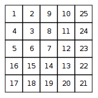

# Title
Number Spiral

A number spiral is an infinite grid whose upper-left square has number 1. Here are the first five layers of the spiral: 

Your task is to find out the number in row yy and column x.

## input
The first input line contains an integer t: the number of tests.

After this, there are tt lines, each containing integers y and x.

## output
For each test, print the number in row y and column x.

## constraints
1 ≤ t ≤ 10^5

1 ≤ y,x ≤ 10^9

## example

3

2 3

1 1

4 2
____________

8

1

15

https://vjudge.net/problem/CSES-1071
