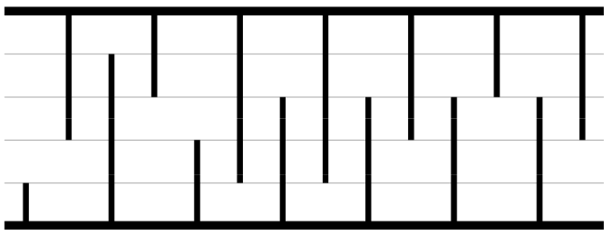
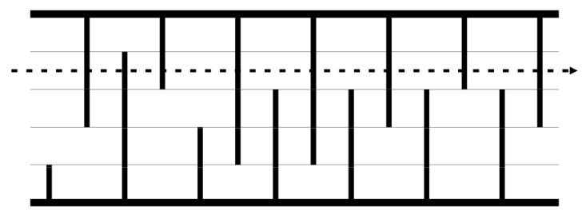

# Title
FIREFLY

A Japanese firefly has flown into a cave full of obstacles: stalagmites (rising from the floor) and stalactites (hanging from the ceiling). The cave is N units long (where N is even) and H units high. The first obstacle is a stalagmite after which stalactites and stalagmites alternate.

Here is an example cave 14 units long and 5 units high (the image corresponds to the second example):

The Japanese firefly is not the type that would fly around the obstacle, instead it will choose a single height and ram from one end of the cave to the other, destroying all obstacles in its path with its mighty kung-fu moves.

In the previous example, choosing the 4:th level from the ground has the firefly destroying eight obstacles:

This is not the best choice because the firefly will end up less tired if it chooses either level one or five, as that would require destroying only seven obstacles.

You are given the width and length of the cave and the sizes of all obstacles.

Write a program that determines the minimum number of obstacles the firefly needs to destroy to reach the end of the cave, and on how many distinct levels it can achieve that number.

## input
The first line contains two integers N and H, 2≤N≤ 200.000
2≤N≤200000, 2 ≤ H ≤ 500.000 the length and height of the cave. 
N will always be even.

The next N lines contain the sizes of the obstacles, one per line. All sizes are positive integers less than H.

## output
Output two integers separated by a single space on a single line. The first number is the minimum number of obstacles the firefly has to destroy and the second is the number of levels on which that can be achieved.

## constraints

## example

6 7
1
5
3
3
5
1

____________
2 3

14 5
1
3
4
2
2
4
3
4
3
3
3
2
3
3
________________
7 2

